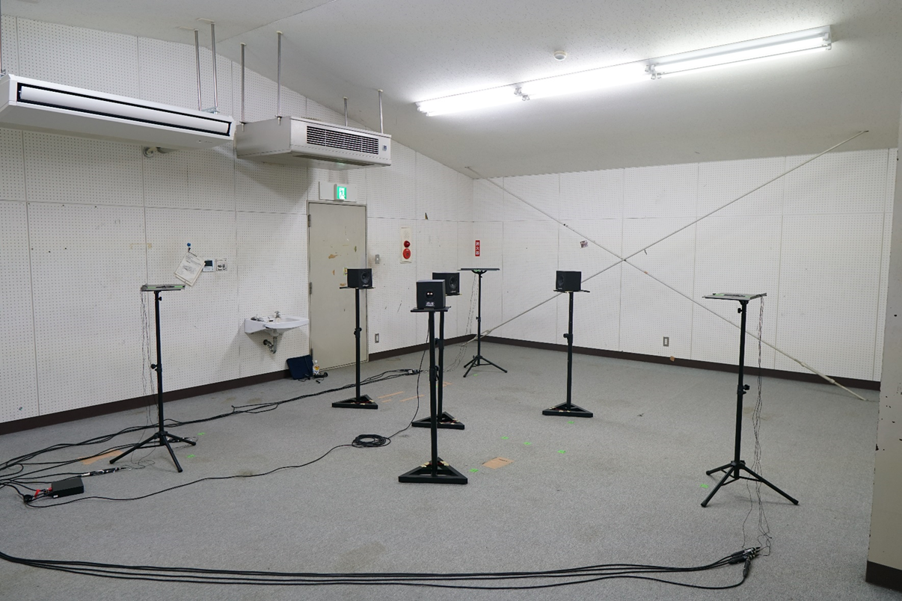
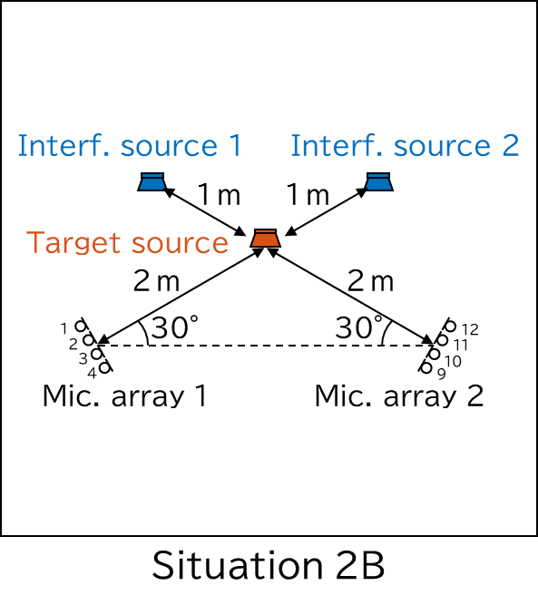

<link rel="stylesheet" href="./white.css">

# マイクロホンアレイ間の非同期性を模擬可能なインパルス応答データセット

## 概要
このインパルス応答データセットは，全てのマイクロホンが完全同期された状態で収録されたものです．マイクロホンアレイ間の同期はできないという想定の下，シミュレーションにより録音開始時刻及びサンプリング周波数のズレを設定することで，マイクロホンアレイ間の非同期条件を再現することを目的としています．このデータセットは音楽練習室及びオープンラウンジの2箇所で，かつ様々な状況の下，収録しました．また，シミュレーションを実施するためのスクリプトも同梱しています．

## フォルダ構成について
~~~
impulse/
├── impulse_dataset/  # 入力となるWAVファイルを格納するフォルダ
│   └── (120ファイル)
├── processWavFiles
├── image/
|    └── (19ファイル)
└── readme.md
~~~

## データセットについて
- **格納場所**: impulse_detaset/roomType_recCond_soundSource_ir_micCh.wav
  - **roomType**: 収録場所(オープンラウンジ：openLounge, 音楽練習室：musicRoom)
  - **recCond**: 収録環境(2A, 2B, 2C, 3A, 3B)
  - **soundSource**: 音源(int1, int2, int3, target)
  - **micCh**: マイクロホンアレイのチャンネル(1~12)

## スクリプトについて
MATLABのコマンドウィンドウ上で下記の関数を実行することで，所望する録音開始時刻及びサンプリング周波数のズレが適用されたWAVファイルを出力することができます．
- **構文**: `processWavFiles(roomType, recCond, fs, recTimeDelay, recFsDeviation)`

引数|説明|入力形式
-|-|-
`roomType`|収録場所 (オープンラウンジ：openLounge, 音楽練習室：musicRoom)|'openLounge'/'musicRoom' 詳細は[マイクロホンアレイとスピーカーの配置](#マイクロホンアレイとスピーカーの配置)を参照
`recCond`|収録環境(2A, 2B, 2C, 3A, 3B)|'2A'/'2B'/'2C'/'3A'/'3B' 詳細は[収録環境](#収録環境)を参照
`fs`|所望するサンプリング周波数 (単位は[Hz])|区間(0, 96000]内の整数値
`recTimeDelay`|所望する録音開始時刻の遅延 (単位は[s])|マイクロホンアレイごとの 遅延時間を含む行ベクトル
`recFsDeviation`|所望するサンプリング周波数の 基準値(fs)からのずれ(単位は[ppm])|マイクロホンアレイごとの ずれを含む行ベクトル
 
### 例（マイクロホンアレイが2個の場合）
`processWavFiles("openLounge", "2A", 48000, [0, 2], [0, 10])`
- 収録場所は"openLounge"
- 収録環境は"2A"
- 所望するサンプリング周波数は48000 Hz
- 2つ目のマイクロホンアレイの録音開始時刻を2 s遅らせる
- 2つ目のマイクロホンアレイのサンプリング周波数を2 ppmずらす

### 例（マイクロホンアレイが3個の場合）
`processWavFiles("musicRoom", "3B", 96000, [1, 2, 3], [2, 4, 6])`
- 収録場所は"musicRoom"
- 収録環境は"3B"
- 所望するサンプリング周波数は96000 Hz
- 1つ目のマイクロホンアレイの録音開始時刻を1 s，2つ目を2 s，3つ目を3 s遅らせる
- 1つ目のマイクロホンアレイのサンプリング周波数をを2 ppm，2つ目を4 ppm，3つ目を6 ppmずらす

## 出力ファイルについて
関数processWavFilesを実行することで，impulseフォルダ内に新たにoutputフォルダが生成され，その中に出力ファイルが生成されます．出力ファイル名は関数に指定したサンプリング周波数，録音開始時刻の遅延，及びサンプリング周波数のずれが表示されるようになっています．

### 例
- `processWavFiles("openLounge", "2A", 48000, [0, 2], [0, 10])`を実行した場合
  - **出力ファイル名**: soundSrc_fs48000_td0.000-2.000_fd0.000-10.000_micCh.wav
    - **soundSrc**: 音源（int1, int2, targetの3種類）
    - **td**: 指定した録音開始時刻の遅延
    - **fd**: 指定したサンプリング周波数のずれ
    - **micCh**: マイクロホンのチャンネル（1-4, 9-12の8チャンネル）

- processWavFiles("musicRoom", "3B", 96000, [1, 2, 3], [2, 4, 6])を実行した場合
  - **出力ファイル名**: soundSrc_fs96000_td1.000-2.000-3.000_fd2.000-4.000-6.000_micCh.wav
    - **soundSrc**: 音源（int1, int2, int3, targetの4種類）
    - **td**: 指定した録音開始時刻の遅延
    - **fd**: 指定したサンプリング周波数のずれ
    - **micCh**: マイクロホンのチャンネル（1-12の12チャンネル）

## 測定環境

### 使用機材

- **マイクロホン**: JTS CX-500（コンデンサマイク）
  - 4つのマイクロホンを等間隔で直線状に配置して1つのマイクロホンアレイを構成

- **スピーカー**: AURATONE 5C Super Sound Cube

- **パワーアンプ**: AURATONE A2-30（5C Super Sound Cube専用）
 
- **オーディオインターフェース**: YAMAHA DM3（96kHz/32ビットのサンプリング周波数で最大8チャンネルの同期再生と16チャンネルの同期録音が可能）

- **AD/DAコンバーター**: Tio1608-D2（全チャンネルの同期AD/DA変換を実現）
- **ソフトウェア**: MATLABのImpulse Response Measurerツール
  - Sample Rate [Hz] : 96000
  - Samples per Frame : 1024
  - Method : Swept sine
    - Wait before first run : 0
    - Pause between runs : 0
    - Number of warm-up runs : 0
    - Sweep start frequency : 10 Hz
    - Sweep stop frequency : 22000 Hz
    - Sweep duration : 6 s
  - Number pf Runs : 10
  - Duration of Runs [s] : 10
  - Excitation Level [dBFS] : -6

### システム構成図

## マイクロホンアレイとスピーカーの配置

### 音楽練習室

- **室温**: 16°C
- **湿度**: 45%
- **部屋の大きさ**: 8.5 m × 6.7 m ×  m
 
- **マイクロホンアレイの高さ**: 床から1.2 m
- **スピーカーコーンの高さ**: 床から1.2 m

- **マイクロホンアレイの間隔**: 1 cm

### オープンラウンジ

#### 実験環境
- **室温**: 19°C
- **湿度**: 35%
- **部屋の大きさ**: 8 m × 7 m × 2.2 m
 
- **マイクロホンアレイの高さ**: 床から1.2 m
- **スピーカーコーンの高さ**: 床から1.2 m

- **マイクロホンアレイの間隔**: 1 cm

## 収録環境
以下の5つの状況をもとに、複数のマイクロホンアレイ及び音源を配置しました．

- **マイクロホンアレイが2個のケース**

- **マイクロホンアレイが3個のケース**

---
