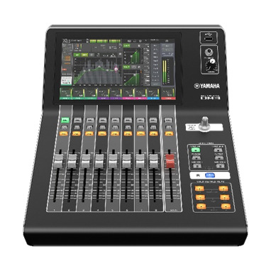
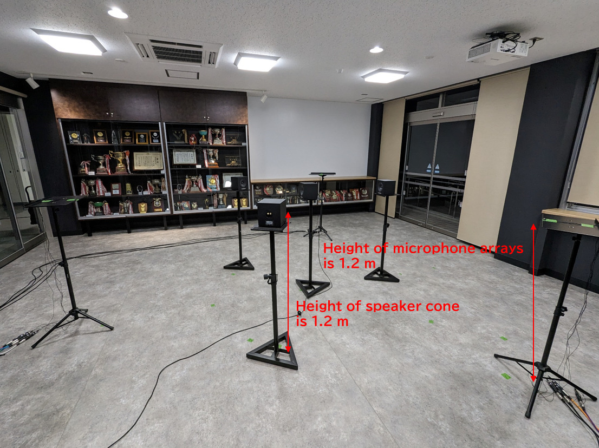

# Inpulse response dataset that can simulate asynchrony between microphone arrays

## Summary
This inpulse response dataset was recorded by perfectly synchronized micropohones. Under the assumption that between microphone arrays can not be synchronized, the simulation aim is to reproduce asynchronous conditions between microphone arrays by setting the delay of recording start time and the deviation of the sample rate. This dataset was recorded in two locations, a music practice room and an open lounge, and under a variety of conditions. The script for running the simulations are also included.

## Folder Structure
~~~
impulse/
├── impulse_dataset/  # Folder to store input WAV files
│   └── (120 files)
├── processWavFiles
├── image/
|    └── (19 files)
└── README.md
~~~

## Dataset
- **Storage Location**: impulse_detaset/roomType_recCond_soundSource_ir_micCh.wav
  - **roomType**: Recording location(openLounge or musicRoom)
  - **recCond**: Recording condition(2A, 2B, 2C, 3A or 3B)
  - **soundSource**: Sound source(int1, int2, int3 or target)
  - **micCh**: channel of microphone(1~12)

## Script
By executing the following function in the MATLAB command window, you can output a WAV files with the desired delay of recording start time and deviation of sample rate.
- **Syntax**: `processWavFiles(roomType, recCond, fs, recTimeDelay, recFsDeviation)`

Argument|Description|Input Format
-|-|-
`roomType`|Recording Location (openLounge or musicRoom)|'openLounge'/'musicRoom' See [Microphone Arrays and Speaker Placement](#microphone-arrays-and-speaker-placement) for details
`recCond`|Recording Condition(2A, 2B, 2C, 3A or 3B)|'2A'/'2B'/'2C'/'3A'/'3B' See [Recording Condition](#recording-condition) for details
`fs`|Desired sample rate (Unit is [Hz])|Integer value in the interval (0, 96000]
`recTimeDelay`|Desired delay of recording start time (Unit is [s])|Row vector containing the delay time for each microphone array
`recFsDeviation`|Deviation from the standard value (fs) of desired sample rate(Unit is [ppm])|Row vector containing the deviation for each microphone array
 
### Example (with 2 microphone arrays)
`processWavFiles("openLounge", "2A", 48000, [0, 2], [0, 10])`
- Recording location is "openLounge"
- Recording condition is "2A"
- Desired sample rate is 48000 Hz
- Delay the recording start time of the second microphone array by 2 s
- Shift the sample rate of the second microphone array by 2 ppm

### Example (with 3 microphone arrays)
`processWavFiles("musicRoom", "3B", 96000, [1, 2, 3], [2, 4, 6])`
- Recording location is "musicRoom"
- Recording condition is "3B"
- Desired sample rate is 96000 Hz
- Delay the recording start time for the first microphone array by 1 s, the second by 2 s, and the third by 3 s
- Shift the sample rate for the first microphone array by 2 ppm, the second by 4 ppm, and the third by 6 ppm

## Output Files
By executing the function processWavFiles, a new "output" folder is created in the impulse folder, and output files are generated in this folder. The output file names display the sample rate, the delay of recording start time, and the deviation of sample rate specified in the function.

### Example
- `processWavFiles("openLounge", "2A", 48000, [0, 2], [0, 10])`
  - **Output File Name**: soundSrc_fs48000_td0.000-2.000_fd0.000-10.000_micCh.wav
    - **soundSrc**: sound source（int1, int2, and target）
    - **td**: Delay of specified recording start time
    - **fd**: Deviation of specified sample rate
    - **micCh**: channel of microphone（8 channels: 1-4, 9-12）

- `processWavFiles("musicRoom", "3B", 96000, [1, 2, 3], [2, 4, 6])`
  - **Output File Name**: soundSrc_fs96000_td1.000-2.000-3.000_fd2.000-4.000-6.000_micCh.wav
    - **soundSrc**: sound source（int1, int2, int3, and target）
    - **td**: Delay of specified recording start time
    - **fd**: Deviation of specified sample rate
    - **micCh**: channel of microphone（1-12）

## Measurement Condition

### Equipment

- **microphone**: JTS CX-500（capacitor microphone）
  - 4 microphones are arranged in a straight line with equal intervals to configure a single microphone array 

- **Speaker**: AURATONE 5C Super Sound Cube

- **Power amplifier**: AURATONE A2-30（Exclusive for 5C Super Sound Cube）

 

- **Audio interface**: YAMAHA DM3（Up to 8 channels of synchronized playback and 16 channels of synchronized recording at 96 kHz/32-bit sample rate）

- **AD/DA converter**: Tio1608-D2（Synchronous AD/DA conversion of all channels）
- **Software**: Impulse Response Measurer tool in MATLAB
  - Sample Rate [Hz] : 96000
  - Samples per Frame : 1024
  - Method : Swept sine
    - Wait before first run : 0
    - Pause between runs : 0
    - Number of warm-up runs : 0
    - Sweep start frequency : 10 Hz
    - Sweep stop frequency : 22000 Hz
    - Sweep duration : 6 s
  - Number pf Runs : 10
  - Duration of Runs [s] : 10
  - Excitation Level [dBFS] : -6

### System Configuration Diagram

## Microphone Arrays and Speaker Placement

### Music Room

- **Room temperature**: 16°C
- **Humidity**: 45%
- **Room size**: 8.5 m × 6.7 m ×  m

 

- **Height of microphone arrays**: 1.2 m from floor
- **Height of speaker cone**: 1.2 m from floor

- **Interval of microphone array**: 1 cm

### Open Lounge

- **Room temperature**: 19°C
- **Humidity**: 35%
- **Room size**: 8 m × 7 m × 2.2 m

 

- **Height of microphone arrays**: 1.2 m from floor
- **Height of speaker cone**: 1.2 m from floor

- **Interval of microphone array**: 1 cm

## Recording Condition
Multiple micorophone arrays and sound sources were placed based on the following 5 situations.

- **Case with 2 microphone arrays**

- **Case with 3 microphone arrays**

---
